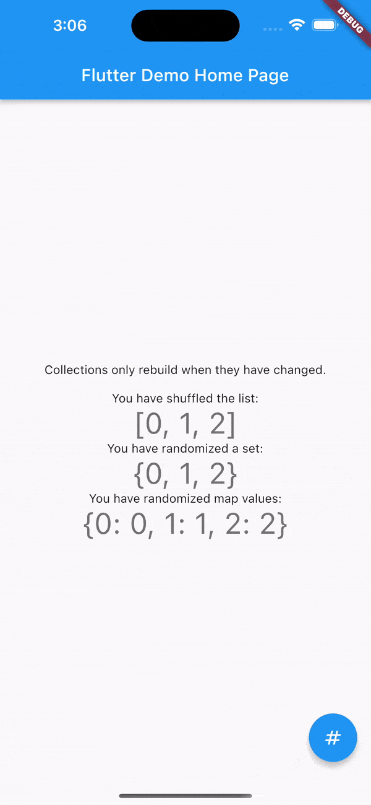

A Flutter package for using Lists, Sets, and Maps in ChangeNotifiers with built-in builders triggered by collection modifications. These make perfect base classes for custom controllers.

Works with all Flutter use-cases since it has no platform plugins and does not require Material or Cupertino parent widgets.

##Features

Use this package in your Flutter app to:
- Trigger listen for changes to an underlying data set.
- Rebuild widgets only when a deep equivalence evaluation shows a list, set, map has been modified.
- Inject collections to child widgets and intelligently propagate those changes to any other listeners.
- Maintain one complex collection-based state throughout the app.
- Use more StatelessWidgets with collection builder widgets.
